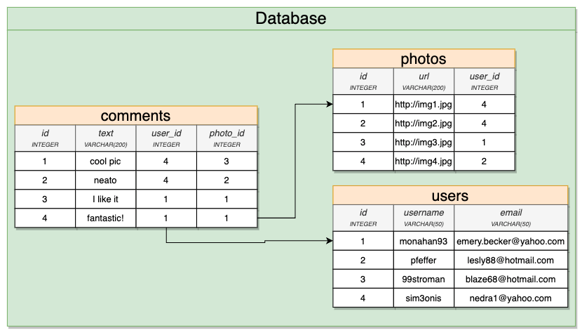

# Postgres notes

## Database design process


---

## Relationships


One-to-Many/Many-to-One


One-to-Many


Many-to-One


One-to-One


Many-to-many


---

## Primary keys and Foreign keys

Description.


Database example.


Who gets the foreign keys in a database?


Database example for a sharing photos application



---

## Data consistency

INSERT constrains


DELETE constrains


---

## Joins and aggregation
```
SELECT contents, username, photo_id
FROM comments
JOIN users ON users.id = comments.user_id;
```

